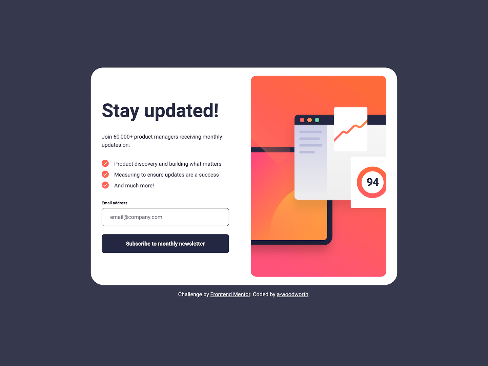

# Frontend Mentor - Newsletter sign-up form with success message solution

This is a solution to the [Newsletter sign-up form with success message challenge on Frontend Mentor](https://www.frontendmentor.io/challenges/newsletter-signup-form-with-success-message-3FC1AZbNrv). Color modifications have been made that differ from the design to meet accessible color contrast ratios.

## Table of contents

- [Overview](#overview)
  - [The challenge](#the-challenge)
  - [Screenshots](#screenshots)
  - [Links](#links)
  - [Built with](#built-with)

## Overview

### The challenge

Users should be able to:

- Add their email and submit the form
- See a success message with their email after successfully submitting the form
- See form validation messages if:
  - The field is left empty
  - The email address is not formatted correctly
- View the optimal layout for the interface depending on their device's screen size
- See hover and focus states for all interactive elements on the page

### Screenshots

**Desktop**

**Tablet**

**Mobile**

### Links

- Solution URL: [Solution](https://www.frontendmentor.io/solutions/newsletter-sign-up-with-success-message----accessibility-javascript-V_7eIhEaHX)
- Live Site URL: [Live Site](https://a-woodworth.github.io/newsletter_signup)

### Built with

- Semantic HTML5 markup
- CSS Custom properties (variables)
- JavaScript
- Constraint Validation API
